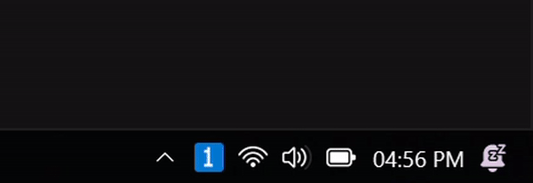

# GlazeWM Tray

A system tray application for [GlazeWM](https://github.com/glzr-io/glazewm) that displays the current active workspace in the system tray icon.



## Features

- Shows the active workspace number in the system tray
- Auto-updates when workspace focus changes
- Generates tray icons dynamically using a custom 3×7 pixel font (no external image dependencies)
- Displays all workspaces in the tray tooltip

## Installation

```bash
bun install
```

## Usage

```bash
bun run main.ts
```

Or compile and run:

```bash
bun build main.ts --compile --outfile main.exe
./main.exe
```

## Requirements

- [GlazeWM](https://github.com/glzr-io/glazewm) must be installed and running

## How It Works

1. Connects to GlazeWM via WebSocket
2. Subscribes to workspace focus events
3. Generates tray icons dynamically with the active workspace number rendered as pixel art
4. Updates the tray icon and tooltip when the focused workspace changes
